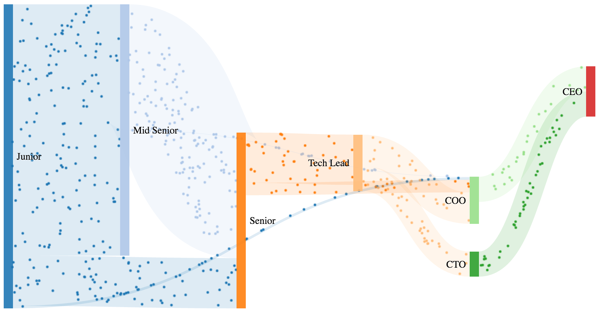
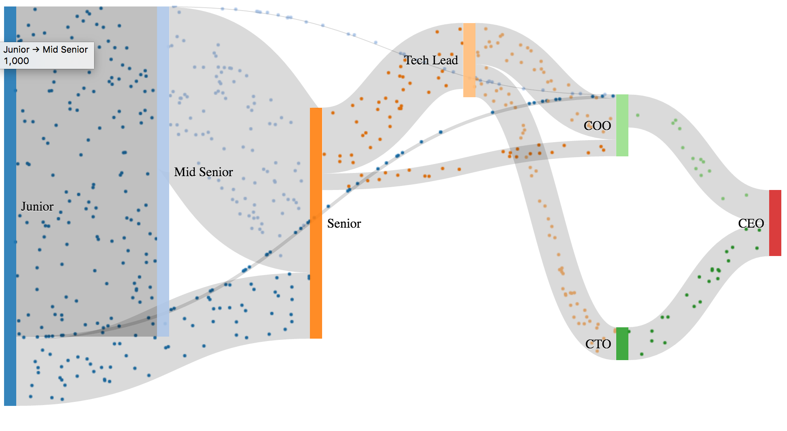

# d3-sankey
D3 Implementation for Sankey chart packaged with AngularJS v1 directive

This Plugin is inspired from rCharts [Examples](https://bl.ocks.org/rogerfischer/54ea5d2148d834a579ec353aeebf594d) with more features and more clean code.




## Options
* **chart**: element selector, It's not needed in case of using Angularjs module.
* **width**: chart width
* **height**: chart height
* **margin**: chart margins
* **nodeWidth**: node width inside Sankey chart.
* **nodePadding**: node padding inside Sankey chart.
* **dynamicLinkColor**: set links background color dynamically according to link source.
* **staticLinkColor**: set links background color statically, this value will not be used in case of using **dynamicLinkColor** options 
## JS Usage
```html
<div id="sankeyChart">
    <canvas></canvas>
    <svg></svg>
</div>
```
```js
var options = {
        chart: '#sankeyChart',
        width: 960,
        height: 500,
        nodeWidth: 15,
        nodePadding: 10,
        //DYNAMIC LINK COLOR WILL OVERWRITE STATIC COLOR IF EXISTS
        dynamicLinkColor: true,
        //staticLinkColor: 'rgb(230, 14, 14)',
        margin: {top: 1, right: 1, bottom: 6, left: 1}
    };
    var data = {
        nodes: [
            {'node': 0, 'name': 'Junior'},
            {'node': 1, 'name': 'Mid Senior'},
            {'node': 2, 'name': 'Senior'},
            {'node': 3, 'name': 'Tech Lead'},
            {'node': 4, 'name': 'CTO'},
            {'node': 5, 'name': 'COO'},
            {'node': 6, 'name': 'CEO'}
        ],
        links: [
            {'source': 0, 'target': 1, 'value': 1000},
            {'source': 0, 'target': 2, 'value': 200},
            {'source': 0, 'target': 5, 'value': 10},
            {'source': 1, 'target': 2, 'value': 500},
            {'source': 1, 'target': 5, 'value': 2},
            {'source': 2, 'target': 3, 'value': 200},
            {'source': 2, 'target': 5, 'value': 50},
            {'source': 3, 'target': 4, 'value': 100},
            {'source': 3, 'target': 5, 'value': 125},
            {'source': 4, 'target': 6, 'value': 100},
            {'source': 5, 'target': 6, 'value': 100}
        ]
    };

    let chart = new d3.sankeyChart(data, options);
```
## AngularJS Usage
```html
<ng-sankey id="sankeyChart" options="options" data="data"></ng-sankey>
```
```js
    var app = angular.module('SankeyApp', ['ngSankey']);

    app.controller('MainController', ['$scope', function ($scope) {
        $scope.options = {
            width: 960,
            height: 500,
            nodeWidth: 15,
            nodePadding: 10,
            dynamicLinkColor: true,
            margin: {top: 1, right: 1, bottom: 6, left: 1}
        };
        $scope.data = {
            nodes: [
                {'node': 0, 'name': 'Junior'},
                {'node': 1, 'name': 'Mid Senior'},
                {'node': 2, 'name': 'Senior'},
                {'node': 3, 'name': 'Tech Lead'},
                {'node': 4, 'name': 'CTO'},
                {'node': 5, 'name': 'COO'},
                {'node': 6, 'name': 'CEO'}
            ],
            links: [
                {'source': 0, 'target': 1, 'value': 1000},
                {'source': 0, 'target': 2, 'value': 200},
                {'source': 0, 'target': 5, 'value': 10},
                {'source': 1, 'target': 2, 'value': 500},
                {'source': 1, 'target': 5, 'value': 2},
                {'source': 2, 'target': 3, 'value': 200},
                {'source': 2, 'target': 5, 'value': 50},
                {'source': 3, 'target': 4, 'value': 100},
                {'source': 3, 'target': 5, 'value': 125},
                {'source': 4, 'target': 6, 'value': 100},
                {'source': 5, 'target': 6, 'value': 100}
            ]
        };
    }]);
```

## Installation 

Bower
```bash
bower install sankeyjs
```

npm
```bash
npm install sankeyjs
```

## MIT Licence

Copyright @2017

Permission is hereby granted, free of charge, to any person obtaining
a copy of this software and associated documentation files (the
"Software"), to deal in the Software without restriction, including
without limitation the rights to use, copy, modify, merge, publish,
distribute, sublicense, and/or sell copies of the Software, and to
permit persons to whom the Software is furnished to do so, subject to
the following conditions:

The above copyright notice and this permission notice shall be
included in all copies or substantial portions of the Software.

THE SOFTWARE IS PROVIDED "AS IS", WITHOUT WARRANTY OF ANY KIND,
EXPRESS OR IMPLIED, INCLUDING BUT NOT LIMITED TO THE WARRANTIES OF
MERCHANTABILITY, FITNESS FOR A PARTICULAR PURPOSE AND
NONINFRINGEMENT. IN NO EVENT SHALL THE AUTHORS OR COPYRIGHT HOLDERS BE
LIABLE FOR ANY CLAIM, DAMAGES OR OTHER LIABILITY, WHETHER IN AN ACTION
OF CONTRACT, TORT OR OTHERWISE, ARISING FROM, OUT OF OR IN CONNECTION
WITH THE SOFTWARE OR THE USE OR OTHER DEALINGS IN THE SOFTWARE.


